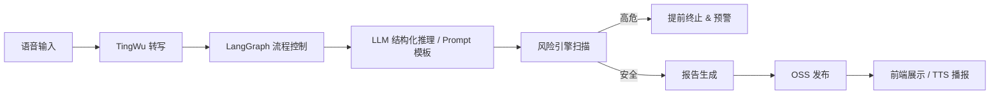

# Depression Agent

> **多模态抑郁症随访智能体框架｜LangGraph 流程控制 × 结构化 Prompt 工程 × 临床质控合规**

---

## 📌 项目概览

**Depression Agent** 提供一个临床可审计的抑郁症随访智能体框架，通过 **LangGraph** 进行可视化流程编排，并将提示工程资产化，形成「**问诊 → 澄清 → 量化评分 → 风险确认 → 总结与报告**」的闭环。框架支持快速接入真实的 **ASR（通义听悟）**、**TTS** 与 **LLM** 能力，实现跨模态的会话采集、临床评估与报告交付。

- 🔁 **流程可控**：显式定义节点、边与守卫条件，保障随访 SOP 与风险终止策略严格落地。
- 🧠 **Prompt 工程模块化**：HAMD-17、诊断总结、澄清问题等模板均资产化，支持 `.env` 覆写与 JSON-only 输出链路回退。
- 🧩 **服务可插拔**：ASR/TTS/LLM/OSS 均以接口形式抽象，方便切换云服务或离线替代方案。
- 📈 **可观测性增强**：内置 `/health`、`/metrics`，配合 Redis 缓存封装与测试套件，便于持续交付。

---

## 🗃️ 仓库结构

```text
apps/
  api/
    main.py                   # FastAPI 入口，聚合 /health、/metrics、/dm、/report 等路由
    router_dm.py              # 对话管理与报告构建 REST 接口
    router_asr_tingwu.py      # ✅ 通义听悟 ASR 上传、转写与任务查询接口
  ui-gradio/
    app.py                    # 多模态前端：Tingwu 实时转写、TTS 播报、流程进度展示
packages/
  common/config.py            # 环境变量解析与配置对象
requirements.txt              # 统一依赖清单
scripts/
  cleanup_session.py          # Redis/内存会话清理工具
  run_api.sh                  # 启动 FastAPI 服务
  run_ui.sh                   # 启动 Gradio 前端
services/
  audio/                      # 听悟 SDK 封装：文件回放 & WebSocket 推流
    tingwu_client.py
    tingwu_async_client.py
  llm/                        # JSON-only LLM 客户端与 Prompt 模板
  orchestrator/               # LangGraph 流程图、节点守卫、风险终止策略
  report/                     # Jinja2 + WeasyPrint 报告生成与导出
  risk/                       # 高危事件识别引擎
  store/                      # Redis 仓储封装（含内存回退）
  tts/                        # 语音合成 Stub，预留真实供应商接入
  oss/                        # ✅ 报告/TTS 制品上传，生成公网 URL
tests/
  test_deepseek_client.py     # JSON-only 客户端与回退策略测试
  test_orchestrator_clarify.py
  test_orchestrator_report.py
  test_report_build_pdf.py
  test_tts_adapter.py
```

> `services/oss` 负责将 PDF 报告与 TTS 音频上传到对象存储，返回前端可直接访问的公网链接。

---

## 🧭 端到端流程



1. **会话初始化**：前端或外部系统调用 `POST /dm/step`，`services/store` 依据 `sid` 装载上下文，`orchestrator` 分配首轮问句。
2. **采集与澄清**：前端上传音频或实时推流，TingWu 返回转写文本；流程根据节点状态触发澄清分支并限制澄清次数。
3. **结构化推理**：`services/llm/json_client.py` 结合 `prompts.py` 模板产出 JSON（HAMD-17、clarify_need、诊断要点），异常自动回退至规则 Stub。
4. **风险监测**：`services/risk/engine.py` 在每轮对话后检测高危关键词并联动 LangGraph 节点（如提前终止、人工干预提醒）。
5. **总结与报告**：`POST /report/build` 触发 Jinja2 模板渲染，WeasyPrint 生成 PDF；`services/oss` 上传生成的报告与语音制品，返回公网 URL。

---

## ⚡ 快速开始

```bash
pip install -r requirements.txt
cp .env.example .env
./scripts/run_api.sh          # 默认 0.0.0.0:8080
./scripts/run_ui.sh           # 默认 0.0.0.0:7860
```

- `.env.example` 列出全部关键变量，请根据部署环境填写。
- Gradio 前端建议将 `gr.Chatbot` 初始化为 `gr.Chatbot(type="messages", ...)`，避免后续版本兼容性告警。

### 常用 API 示例

```bash
# 1. 获取首轮问句
curl -X POST "http://127.0.0.1:8080/dm/step" -H "Content-Type: application/json" -d '{"sid":"demo-session","role":"user"}'

# 2. 追加一轮对话（文本）
curl -X POST "http://127.0.0.1:8080/dm/step" -H "Content-Type: application/json" -d '{"sid":"demo-session","role":"user","text":"最近睡得不太好"}'

# 3. 上传音频并触发 TingWu 转写
curl -s -F "sid=tf_demo" -F "file=@/tmp/sample16k.wav" http://127.0.0.1:8080/asr/tingwu/upload | jq -r .audio_ref
curl -s -X POST http://127.0.0.1:8080/asr/tingwu/transcribe -H 'Content-Type: application/json' -d '{"sid":"tf_demo","audio_ref":"<audio_ref_from_upload>"}' | jq

# 4. 生成 PDF 报告
curl -X POST "http://127.0.0.1:8080/report/build" -H "Content-Type: application/json" -d '{"sid":"demo-session"}'
```

Gradio 前端会展示 TingWu 转写文本，并播放 `tts_url` 指向的音频文件，实现跨模态随访体验。

---

## 🔌 真实服务配置

| 能力 | 关键文件 | 环境变量（示例） | 说明 |
| --- | --- | --- | --- |
| 听悟实时识别 / 文件回放 | `services/audio/tingwu_client.py`, `services/audio/tingwu_async_client.py` | `ALIBABA_CLOUD_ACCESS_KEY_ID`、`ALIBABA_CLOUD_ACCESS_KEY_SECRET`、`ALIBABA_TINGWU_APPKEY`、`TINGWU_REGION`、`TINGWU_FORMAT=pcm`、`TINGWU_SAMPLE_RATE=16000` | 支持创建实时任务 → NLS SDK 推流 → 结果回传，并提供异步创建/停止封装 |
| LLM JSON-only 通道 | `services/llm/json_client.py`, `services/orchestrator/langgraph_core/llm_tools.py`, `services/orchestrator/prompts/` | `DEEPSEEK_API_BASE`、`DEEPSEEK_API_KEY` | OpenAI 兼容 `/chat/completions`；异常自动回退至规则 Stub，策略/评分提示词集中在 orchestrator 层 |
| 语音合成 | `services/tts/` | 例如 `COSYVOICE_API_KEY` | 以 Stub 为基线，可替换为供应商 SDK，返回本地或公网 URL |
| OSS 制品管理 | `services/oss/client.py` | `OSS_ENDPOINT`、`OSS_BUCKET`、`OSS_ACCESS_KEY_ID`、`OSS_ACCESS_KEY_SECRET`、可选 `OSS_KEY_PREFIX` | 报告 PDF 与 TTS 音频统一上传，返回公网 URL |

---

## ✅ 测试与质量保障

```bash
pytest
```

- `tests/test_deepseek_client.py`：覆盖 JSON-only 提示工程链路与回退策略。
- `tests/test_langgraph_coordinator.py`、`tests/test_strategy_flow.py`：验证 LangGraph 主流程与动态加边行为。
- `tests/test_output_node.py`、`tests/test_risk_node.py`：检查风险守卫、媒体播报与统一出参结构。
- `tests/test_report_build_pdf.py`、`tests/test_reporting.py`：确保报告模板在提示输出变动时仍可渲染。
- `tests/test_tts_adapter.py`：确认 CosyVoice/DashScope 语音制品链路一致性。

---

## 🛠️ 运维与故障排查

- 清理指定会话缓存：`python scripts/cleanup_session.py --sid <SESSION_ID>`
- 清空 Redis（慎用）：`python scripts/cleanup_session.py --all`
- 建议 Redis 配置：`appendonly yes`、`save 900 1`；可根据资源设置 `maxmemory-policy allkeys-lru`。
- 常用排错命令：`redis-cli INFO`、`redis-cli SLOWLOG GET`、`redis-cli MONITOR`（开发阶段）。
- 生产建议：为 `/metrics` 对接 Prometheus，结合集中式日志分析端到端耗时与失败率。

---

## 🧭 里程碑与展望

1. **实时字幕增强**：完善 TingWu WebSocket 推流的 SentenceBegin/Changed/End 事件，提升实时字幕体验。
2. **Prompt A/B 测试**：针对 DeepSeek 清洗与澄清提示词开展数据驱动迭代，形成标签化语料库。
3. **TTS 供应商接入**：引入正式语音合成厂商并优化缓存策略，降低响应时延。
4. **报告多渠道发布**：支持 OSS/CDN/邮件等多种导出方式，并探索国际化模板。

---

## 📄 License

根据项目策略选择适当的开源或私有协议（如 MIT / Apache-2.0），并在此处补充说明。
